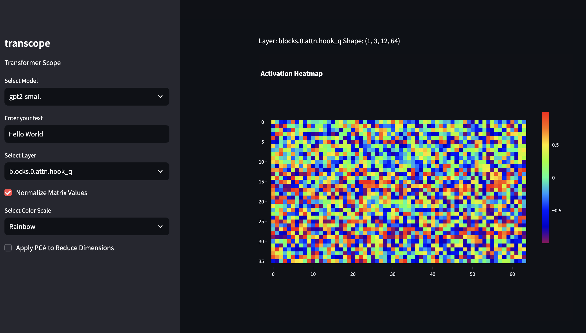

# transcope

Simple script to visualize activation tensors for Transformer models. Wraps over [transformer-lens](https://github.com/TransformerLensOrg/TransformerLens)


<br>


## Installation

1. Clone the repository:

   ```bash
   git clone https://github.com/attentionmech/transcope.git
   cd transcope
   ```

2. Install dependencies:

   Create and activate a virtual environment (optional but recommended):

   ```bash
   python -m venv venv
   source venv/bin/activate
   ```

3. Install the required Python libraries:

   ```bash
   pip install streamlit plotly transformer-lens scikit-learn numpy
   ```

4. Launch the Streamlit app:

   ```bash
   streamlit run transcope.py
   ```


## Dependencies

- `numpy`
- `plotly`
- `transformer-lens`
- `streamlit`
- `scikit-learn`
