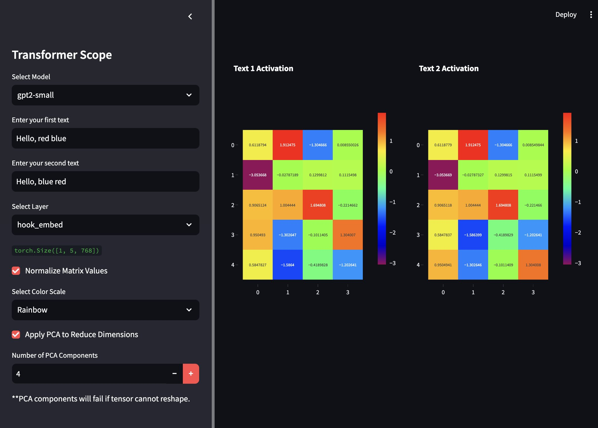

# transformer-scope

Simple script to visualize activation tensors for Transformer models. Wraps over [transformer-lens](https://github.com/TransformerLensOrg/TransformerLens) which support [these](https://transformerlensorg.github.io/TransformerLens/generated/model_properties_table.html) models.

<br>


<br>


## Installation

1. Clone the repository:

   ```bash
   git clone https://github.com/attentionmech/transformer-scope.git
   cd transformer-scope
   ```

2. Install dependencies:

   Create and activate a virtual environment (optional but recommended):

   ```bash
   python -m venv venv
   source venv/bin/activate
   ```

3. Install the required Python libraries:

   ```bash
   pip install streamlit plotly transformer-lens scikit-learn numpy
   ```

4. Launch the Streamlit app:

   ```bash
   streamlit run transcope.py
   ```

## Walkthrough

We use Principal Component Analysis (PCA) to reduce the dimensionality of high-dimensional activation tensors from models. The activation tensors are first reshaped (e.g., using reshape(-1, <last dimension size>)) to combine the tokens' activations into a 2D matrix, such as (7, 768) (7 tokens, 768 features each). PCA is then applied to reduce this to (7, 2), capturing the most important features in just 2 dimensions. This makes it easier to visualize and compare token activations while retaining the key information for further analysis.


## Dependencies

- `numpy`
- `plotly`
- `transformer-lens`
- `streamlit`
- `scikit-learn`
